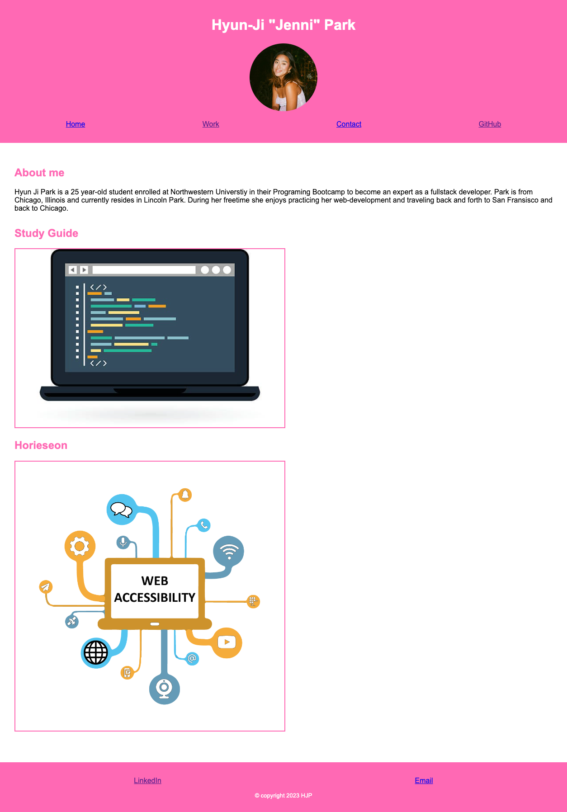

# challenge-02
## Description
This assignement is a portfolio of the early stages of bootcamp, highlighting the strongest work I have completed. 
## Acceptance Criteria 
- I added a photo of myself and links to sections about myself, my work, and how to contact me
- I made it so when you click one of the links in the navigation
- I made it so when you click on the link to the section about my work it sends you to where the work is located
- The UI scrolls to a section with titled images of the developer's applications
- You are able to see the developer's first application
- I made it so that application's image should be larger in size than the others 
- When I click on the images of the applications
- I am taken to that deployed application
- I resized the page or view the site on various screens and device
- I have a responsive layout that adapts to my viewport
## Overview

## Deployed Repository
https://hjenp22.github.io/challenge-02/
### About Author
- email: hjipark22@gmail.com
